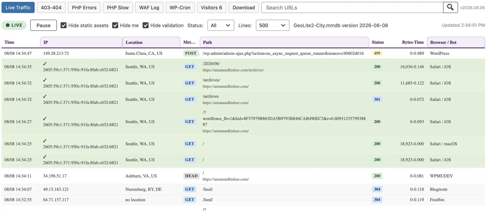
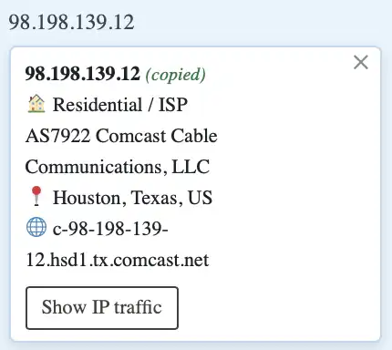
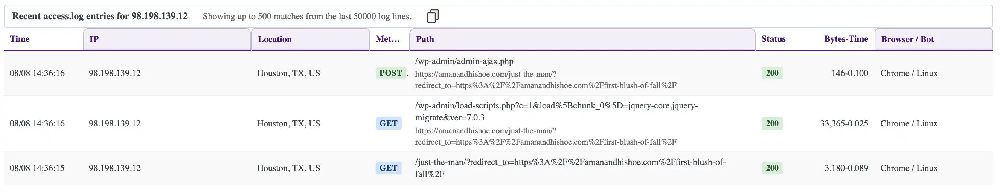
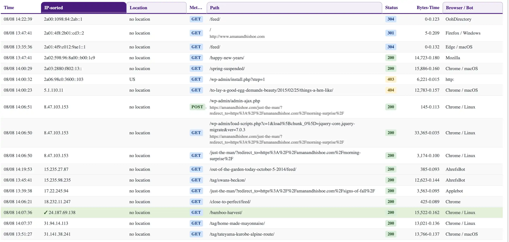
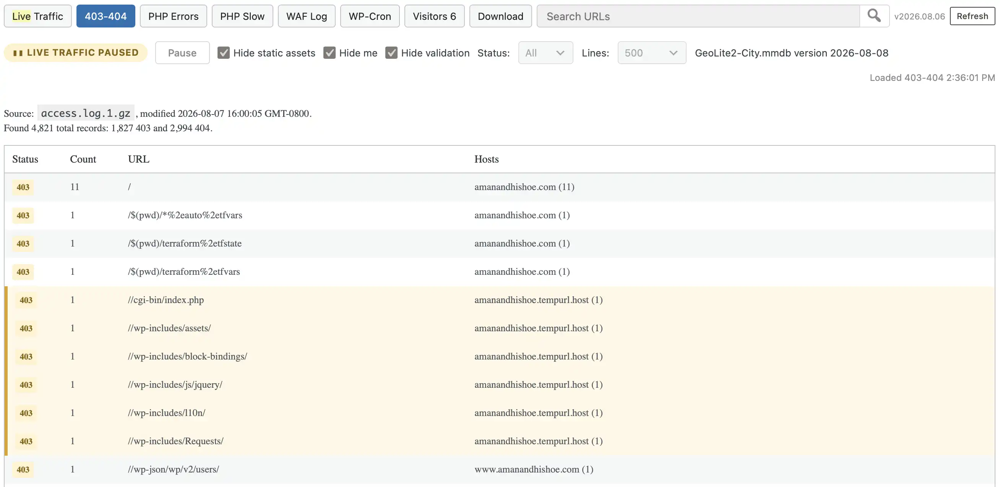
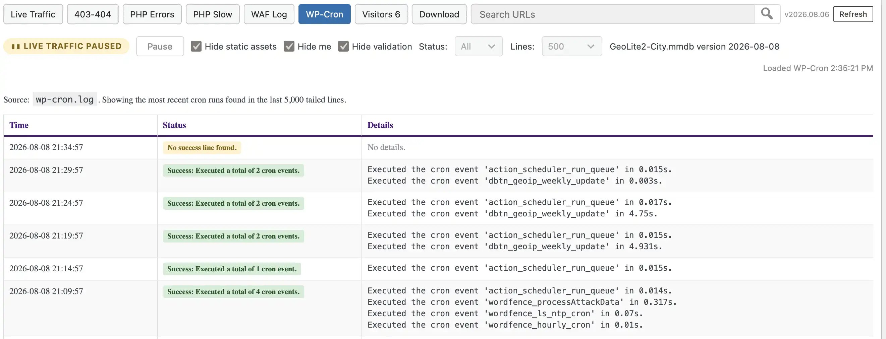
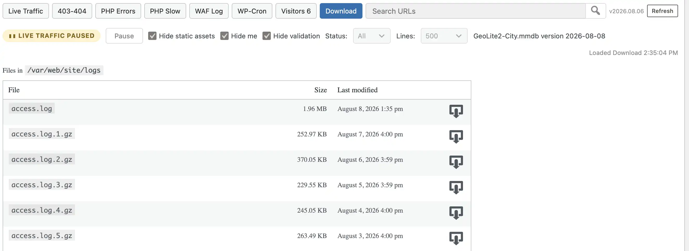

# DBTN Live Traffic

Version 1.0.17

DBTN Live Traffic is a standalone WordPress plugin that provides a real-time
server-log dashboard, Cloudflare Turnstile visitor validation, daily
validated-visitor counts, secure log downloads, and local MaxMind GeoLite2
City lookups.

It is designed solely for WPMU DEV hosting environments and single-site
WordPress installations. WordPress Multisite is not currently supported because
server logs may contain traffic from multiple sites in the same network.

## Screenshots

The following screenshots show the main administrator features of DBTN Live Traffic.

### Live Traffic dashboard



The Live Traffic panel displays parsed access-log entries with location,
status, duration, browser information, and sorting/filtering controls.

### IP inspection



Clicking an IP displays additional information about the address.



Administrators can view recent traffic from a specific IP address.

### Sorting and filtering



Traffic rows can be sorted by IP, path, browser/bot, or location.

### Log reports



The 403-404 tab summarizes blocked and missing requests from the previous day.



The WAF tab displays recent ModSecurity events in a readable format.

### Secure downloads



The Download tab lists available log files and streams downloads through
WordPress authentication.

## Features

### Live Traffic dashboard

- Adds a top-level **Live Traffic** admin menu for users with the
  `manage_options` capability.
- Reads the current access log and refreshes the table every five seconds.
- Supports pause/resume and selectable tail sizes from 50 to 2,500 lines.
- Bridges the midnight UTC rotation with cached lines from `access.log.1.gz`,
  keeping the display populated while the new `access.log` is still short.
- Filters static assets, the current administrator's traffic, validation REST
  requests, and HTTP status groups (2xx, 3xx, and 4xx).
- Filters the displayed rows by a case-insensitive full-URL search.
- Displays request time, IP or known WordPress username, GeoIP location,
  method, request path and referrer, response status, response size and request
  duration, and a summarized browser or bot user agent.
- Highlights Turnstile-validated visitors and flags non-canonical hostnames.
- Sorts the visible rows by IP, path, browser/bot, or location when the
  corresponding column header is selected.
- Lets administrators inspect recent requests from a selected IP.
- Lets administrators inspect or search recent requests for a URL path;
  query strings are ignored when matching non-root paths.
- Copies the visible IP- or URL-specific traffic rows to the clipboard as
  tab-separated data.
- Provides a browser-side IP information card and copy-IP action using
  `ipinfo.io`.

### Log reports

| Tab | Data source | Description |
|---|---|---|
| Live Traffic | `access.log` | Real-time, parsed access-log rows with visitor and location data |
| 403-404 | `access.log.1.gz` | Yesterday's compressed-log 403/404 totals, grouped by request and hostname |
| PHP Errors | `php_errors.log` | PHP errors from the last seven days |
| PHP Slow | `php_slow.log` | PHP slow-log entries from the last seven days, grouped into timestamped blocks |
| WAF Log | `waf.log` | Recent ModSecurity JSON events rendered as readable cards |
| WP-Cron | `wp-cron.log` | Recent cron runs grouped by timestamp, status, and details |
| Visitors | WordPress options | Latest 100 daily validated-human counts; shown only when Turnstile is configured |
| Download | Configured logs directory | Readable files with name, size, modified time, and a download action |

Report tabs can be refreshed manually without reloading the admin page.

### Secure log downloads

- Lists readable regular files directly inside the configured logs directory.
- Shows each file's name, size, and last-modified time.
- Streams the selected file through WordPress instead of exposing the logs
  directory as a public URL.
- Requires the `manage_options` capability and a valid per-download nonce.
- Rejects directory traversal, nested paths, missing files, unreadable files,
  and files that resolve outside the configured logs directory.

### Cloudflare Turnstile visitor validation

- Loads the invisible Turnstile client on public pages when a site key is
  configured; server-side validation also requires the secret key.
- Defers the first challenge until visitor interaction, with a three-second
  fallback for visitors who do not interact.
- Stores validated IPs in WordPress transients for seven days.
- Issues a signed, HttpOnly, SameSite=Lax `dbtn_human` grant cookie after a
  successful challenge.
- Reasserts the signed grant during later page activity so a validated visitor
  remains identified when Private Relay, mobile networks, or Wi-Fi transitions
  change the visitor's egress IP.
- Associates a logged-in WordPress username with its current IP for eight hours
  so the Live Traffic table can identify that user.

### Daily validated visitors

- Counts each validated IP once per WordPress calendar day.
- Stores counts as `dbtn_human_visits_YYYY-MM-DD` options.
- Displays today's count in the **Visitors** tab label.
- Shows the latest 100 daily records in a table sortable by date or count.

### Credential validation and settings

The **Live Traffic → Settings** page provides:

- Cloudflare Turnstile site key and secret key fields.
- A **Validate Turnstile** action that tests the entered, unsaved keys.
- MaxMind account ID and license key fields.
- A **Validate MaxMind** action that tests the entered, unsaved credentials.
- An optional absolute logs-directory override.
- Configuration status and client-IP diagnostics.

All settings are stored in the `dbtn_lt_settings` WordPress option. Secret
values are used server-side and are not exposed to public visitors.

### MaxMind GeoLite2 City

- Downloads the GeoLite2 City database with configured MaxMind credentials.
- Installs database updates atomically into
  `GeoLite2/GeoLite2-City.mmdb`.
- Checks the remote `Last-Modified` value before downloading an update.
- Schedules a weekly WordPress cron update and queues an immediate update when
  the admin dashboard detects a newer database.
- Shows the installed database build date and update status in the toolbar.
- Caches each IP lookup in a WordPress transient for 24 hours.
- Emails the WordPress administration address after a successful database
  update.

## Requirements

- PHP 8.1 or newer
- WordPress 6.4 or newer
- Server logs in the formats expected by the report parsers
- Cloudflare Turnstile keys for visitor validation and the Visitors report
- A MaxMind account ID and license key for GeoLite2 City installation and
  updates
- WordPress cron, outbound HTTPS, and a writable `GeoLite2/` directory for
  automatic database updates
- A single-site WordPress installation
- WordPress Multisite is not currently supported

The client-IP resolver prefers `CF-Connecting-IP` and falls back to
`REMOTE_ADDR`. Configure the web server or trusted proxy layer so visitors
cannot spoof forwarded IP headers.

## Installation

1. Copy the plugin folder to `wp-content/plugins/dbtn-live-traffic/`.
2. Activate **DBTN Live Traffic** in **WP Admin → Plugins**.
3. Open **Live Traffic → Settings**.
4. Enter and validate the Cloudflare Turnstile credentials.
5. Enter and validate the MaxMind credentials.
6. Save the settings.
7. If the logs are not in the default location, enter their absolute directory
   path in **Logs Directory**.

### Turnstile setup

1. Open the [Cloudflare Turnstile dashboard](https://dash.cloudflare.com/?to=/:account/turnstile).
2. Create a widget with **Widget type** set to **Invisible**.
3. Add the site's hostname to the widget's allowed hostnames.
4. Enter the site key and secret key on the plugin settings page.
5. Select **Validate Turnstile**, then save the settings.

### Log directory

By default, logs are read from a `logs` directory one level above the document
root:

```text
dirname($_SERVER['DOCUMENT_ROOT'])/logs/
```

For example, a document root of `/home/user/public_html` resolves to
`/home/user/logs/`.

To use a different location, enter the absolute path in
**Live Traffic → Settings → Logs Directory**. A trailing slash is optional.

## REST API

Public validation routes use a Turnstile token or signed human-grant cookie.
All admin routes require the `manage_options` capability.

| Method | Route | Access | Purpose |
|---|---|---|---|
| POST | `/dbtn/v2/validation/ip` | Public; Turnstile token required | Validate the current IP and issue a human-grant cookie |
| POST | `/dbtn/v2/validation/assert` | Public; signed cookie required | Re-mark the current IP after an IP change |
| POST | `/dbtn/v2/admin/credentials/turnstile` | Administrator | Validate entered Turnstile credentials |
| POST | `/dbtn/v2/admin/credentials/maxmind` | Administrator | Validate entered MaxMind credentials |
| GET | `/dbtn/v2/admin/live-traffic` | Administrator | Return parsed live access-log rows |
| GET | `/dbtn/v2/admin/ip-traffic` | Administrator | Return recent access-log rows for one IP |
| GET | `/dbtn/v2/admin/url-traffic` | Administrator | Return recent access-log rows for one URL path |
| GET | `/dbtn/v2/admin/log-403-404` | Administrator | Return the 403/404 report |
| GET | `/dbtn/v2/admin/php-errors` | Administrator | Return the PHP errors report |
| GET | `/dbtn/v2/admin/php-slow` | Administrator | Return the PHP slow-log report |
| GET | `/dbtn/v2/admin/waf-log` | Administrator | Return the WAF report |
| GET | `/dbtn/v2/admin/wp-cron` | Administrator | Return the WP-Cron report |
| GET | `/dbtn/v2/admin/visitors` | Administrator; Turnstile configured | Return daily validated-visitor counts |
| GET | `/dbtn/v2/admin/downloads` | Administrator | List readable files in the configured logs directory |

Actual file downloads use WordPress's authenticated `admin-post.php` handler
with the `dbtn_traffic_download` action and a download nonce.

## File structure

The following map lists the plugin's first-party files that are loaded or
served by version 1.0.17. The `vendor/` directory contains bundled third-party
Composer dependencies and is summarized separately.

```text
dbtn-live-traffic/
├── dbtn-live-traffic.php
│   Plugin metadata, constants, class loading, and bootstrap
├── README.md
│   Plugin documentation
├── admin/
│   ├── class-dbtn-lt-admin.php
│   │   Admin menus, settings, validation controls, and diagnostics
│   ├── class-dbtn-geoip.php
│   │   Local GeoLite2 City lookup and 24-hour result caching
│   └── traffic/
│       ├── README.md
│       │   Internal Traffic module documentation
│       ├── class-dbtn-traffic.php
│       │   Dashboard shell, tabs, toolbar, asset loading, and secure downloads
│       ├── class-dbtn-traffic-rest.php
│       │   Administrator REST routes, tables, reports, and download listing
│       ├── class-dbtn-traffic-log-reader.php
│       │   Access-log parsing, tailing, user-agent summaries, and statuses
│       ├── class-dbtn-traffic-report-403-404.php
│       │   Compressed access-log 403/404 report
│       ├── class-dbtn-traffic-report-php-errors.php
│       │   Seven-day PHP error report
│       ├── class-dbtn-traffic-report-php-slow.php
│       │   Seven-day PHP slow-log report
│       ├── class-dbtn-traffic-report-waf.php
│       │   ModSecurity JSON/WAF report
│       ├── class-dbtn-traffic-report-wp-cron.php
│       │   Grouped WP-Cron report
│       ├── class-dbtn-traffic-report-visitors.php
│       │   Daily validated-human report
│       ├── css/
│       │   └── dbtn-traffic.css
│       │       Dashboard and report styles
│       └── js/
│           └── dbtn-traffic.js
│               Polling, tabs, filters, searches, sorting, details, and copying
├── assets/
│   ├── css/
│   │   └── dbtn-credential-validation.css
│   │       Settings-page credential status styles
│   └── js/
│       ├── dbtn-passport.js
│       │   Invisible Turnstile loader and token creation
│       ├── dbtn-visitor-validate.js
│       │   First-time validation and signed-grant reassertion
│       └── dbtn-credential-validation.js
│           Turnstile and MaxMind settings-page validation
├── includes/
│   ├── class-dbtn-utilities.php
│   │   Client-IP resolution and Turnstile verification
│   ├── class-dbtn-geoip-update.php
│   │   GeoLite2 download, installation, version check, and WP-Cron update
│   ├── class-dbtn-visitor-validator.php
│   │   Validation state, daily counts, user/IP mapping, and signed grants
│   ├── class-dbtn-validation-rest.php
│   │   Public validation REST routes
│   ├── class-dbtn-credentials-rest.php
│   │   Administrator credential-validation REST routes
│   ├── class-dbtn-emails.php
│   │   Administration email helpers
│   └── class-dbtn-passport.php
│       Reserved compatibility class; browser token logic is in the JS file
├── GeoLite2/
│   └── GeoLite2-City.mmdb
│       Runtime database downloaded after MaxMind setup; not bundled initially
└── vendor/
    ├── autoload.php
    ├── composer/
    ├── geoip2/geoip2/
    ├── maxmind-db/reader/
    └── maxmind/web-service-common/
        Bundled Composer autoloader, certificate bundle, and MaxMind libraries
```

## Data storage

| Key or path | Storage | Lifetime or purpose |
|---|---|---|
| `dbtn_lt_settings` | WordPress option | Plugin settings |
| `dbtn_valid_ip_{md5}` | WordPress transient | Validated IP, seven days |
| `dbtn_login_ip_{md5}` | WordPress transient | Username associated with IP, eight hours |
| `dbtn_human_visit_YYYY-MM-DD_{md5}` | WordPress transient | Per-IP daily-count guard, until next WordPress midnight |
| `dbtn_human_visits_YYYY-MM-DD` | WordPress option | Daily validated-human total |
| `dbtn_geoip_{md5}` | WordPress transient | GeoIP lookup result, 24 hours |
| `dbtn_geoip_update_available` | WordPress transient | MaxMind update-check result, 15 minutes |
| `dbtn_human` | Browser cookie | Signed human grant, seven days |
| `GeoLite2/GeoLite2-City.mmdb` | Local file | Installed MaxMind GeoLite2 City database |

## Code quality

The first-party PHP source uses strict types, WordPress capability and nonce
checks for administrator actions, and WordPress escaping and sanitization APIs
at input and output boundaries.

The codebase is analyzed with PHPStan at level 8 using WordPress stubs and
follows WordPress Coding Standards through PHPCS.

## Changelog

### 1.0.17

- Clicking a request path now copies it without filtering or pausing live traffic.
- Option-clicking a path copies the path and referrer on separate lines.
- Clicking a request time copies the full row as tab-separated values.
